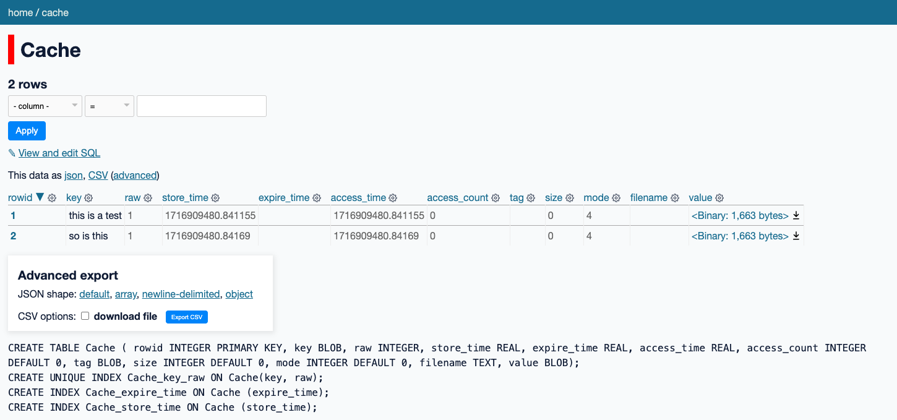

# ⚡ tokenvolt

> Populate an embedding cache quickly and get on with your day.

This library contains a simple script that I like to use to embed text. This tends to be compute intensive so I prefer to run these runs only once, which is why the results are cached on disk. This is also a use-case where [Modal](https://modal.com/) shines.

That said, the approach is a bit hacky, embeddings are stored in sqlite via [diskcache](https://grantjenks.com/docs/diskcache/), but it works. Sqlite is a nice format that you can also copy and paste to a blob store. This results in a nice minimal set of requirements but odds are that you eventually will want to move these embeddings elsewhere ... eventually.

## Install

```
python -m pip install modal sentence-transformers diskcache srsly
```

## Usage

Assuming that you have a JSONL file somewhere with a 'text' key in each row that you'd like to embed.

```
model run embed.py --jsonl-file data.jsonl --jsonl-col text --cache-name local-cache
```

This is a bit slow the first time you run it because the backend needs to be provisioned. But once it gets started, you should see some sqlite files being populated locally. In the base settings that would result in a folder structure like below:

```
📁 Project Root
┣━━ 📁 local-cache
┃   ┗━━ 📁 all-MiniLM-L6-v2
┃       ┗━━ 💽 cache.db
┗━━ 🐍 embed.py
```

If you really really wanted to you could inspect the cache. Here's what it could look like from datasette.



From here you may fetch the embeddings by looping over all the cache values.

```python
from diskcache import Cache

cache = Cache('local-cache/all-MiniLM-L6-v2')
for key in cache.iterkeys():
    print(key, cache[key])
```

Each key in the cache represents the string that was embedded, so this is a convenient way to get the pairs out.

## Switching the GPU and the sentence transformer

To change these settings you're going to have to change the `embed.py` file. The two `EMBEDDING_MODEL` and `GPU_CONFIG` constants need to be known upfront to provision the worker, so that unfortunately cannot be done from the command line.
